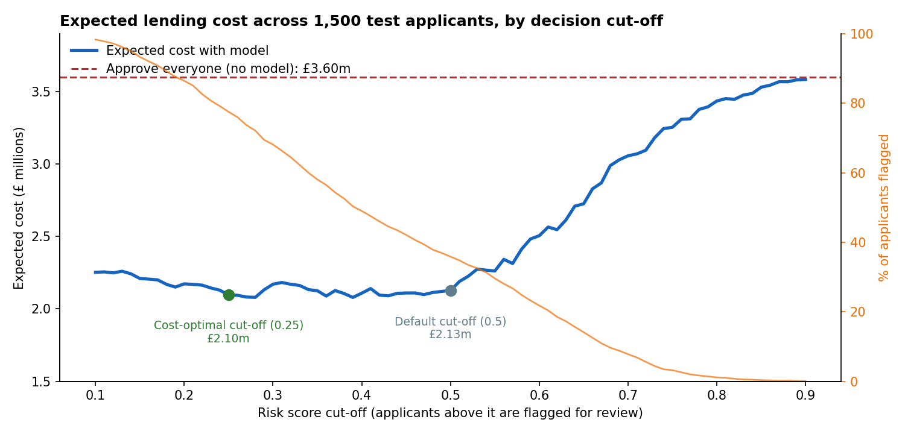
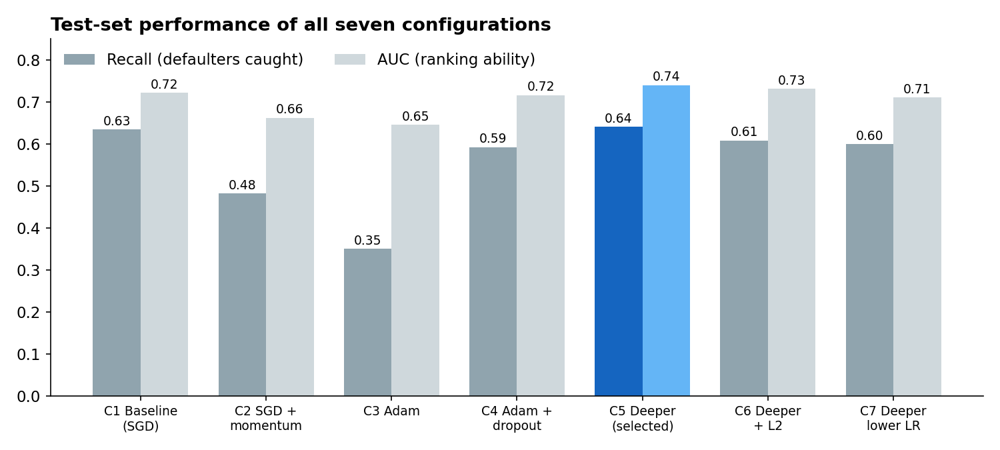
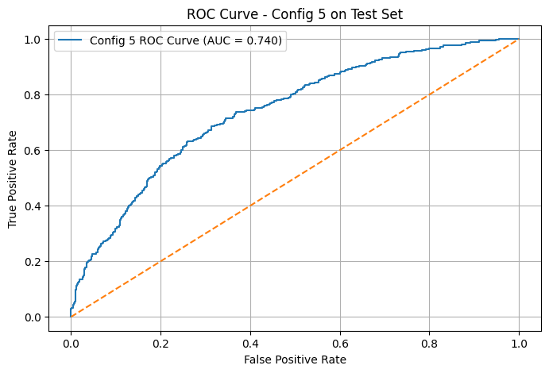
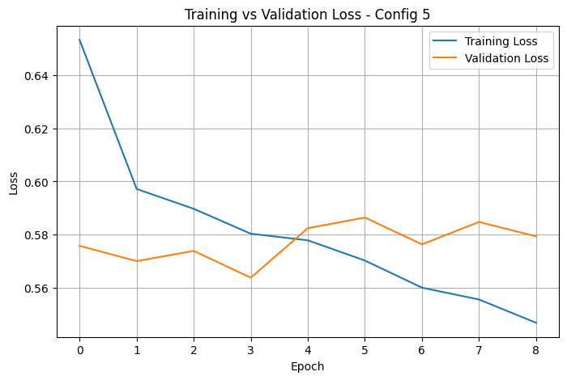

# Credit Risk: Reducing Lending Losses with Default Prediction

**A business analytics case study: using predictive modelling to decide which loan applicants to flag for review, and where to set the cut-off.**

*Python · pandas · scikit-learn · TensorFlow/Keras*

---

## Key outcomes

*Based on 10,000 simulated loan applications.*

- **Cut expected lending losses by an estimated 42%** compared with approving every applicant, from £3.60m to about £2.10m across 1,500 test applicants.
- **Identified review capacity as the real business constraint:** beyond a certain point, flagging more applicants barely reduces losses but doubles the manual review workload.
- **Recommended a simpler, explainable model,** which performed as well as a complex neural network while being easier to justify to customers and regulators.

---

## Skills demonstrated

**Cost-benefit analysis** · **Decision analysis and recommendations** · **Stakeholder-ready reporting** · **Process design** · **Predictive modelling** · **Data preparation** · **Sensitivity analysis** · **Python (pandas, scikit-learn)**

---

## 1. The business problem

Lenders face two kinds of mistake, and they are not equally costly:

- **Approving a borrower who defaults** causes a direct loss of the unpaid loan balance.
- **Flagging a borrower who would have repaid** loses the interest income and risks losing the customer.

In this data, a missed default costs on average **about six times more** than wrongly flagging a good customer (£12,392 vs £1,975). The goal was therefore to build a model that catches as many defaulters as possible, and then to decide **where to draw the line** so that total expected cost is as low as possible while keeping the review workload realistic.

## 2. The data

10,000 simulated loan applications with no missing values, of which 20.6% defaulted. Features cover:

- **Loan details:** amount, term, interest rate, purpose, credit sub-grade
- **Borrower profile:** annual income, employment length, home ownership, verification status, state
- **Credit behaviour:** FICO score, debt-to-income ratio, credit utilisation, recent enquiries, delinquencies and public records

> **Note:** The data is simulated and follows US lending conventions (e.g. FICO scores). Recommendations are framed for a UK lender. Results show the method and reasoning, not real-world lending performance.

## 3. Approach

1. **Prepared the data:** removed identifiers, split the issue date into year and month, removed the redundant `grade` field, encoded categories and standardised numeric fields.
2. **Split the data** into 70% training, 15% validation and 15% test, with class weights so the model didn't ignore the minority of defaulters.
3. **Compared seven neural network designs**, changing one thing at a time to see what actually improved results.
4. **Benchmarked against logistic regression** to test whether the added complexity was worth it.
5. **Built a cost model** using each applicant's own loan amount, interest rate and term, and chose the decision cut-off on the validation set before confirming it on unseen test data.

**Cost assumptions** (stated openly so they can be challenged):

| Error | Assumed cost |
|---|---|
| Missed defaulter | 60% of the loan amount is lost |
| Good customer wrongly flagged | 50% of the loan's lifetime interest is lost as profit |

## 4. Results: what each decision costs

Every applicant receives a risk score between 0 and 1. The **cut-off** is the score above which an applicant is flagged for review: a lower cut-off flags more people.

| Scenario | Expected cost | Defaulters caught | Applicants flagged for review |
|---|---|---|---|
| Approve everyone (no model) | £3.60m | 0 of 309 | 0% |
| Model, standard cut-off (0.5) | £2.13m | 203 of 309 | 36% |
| Model, cost-optimal cut-off (0.25) | £2.10m | 292 of 309 | 78% |

**What this shows:**

- **The model cuts expected losses by about 42%** compared with approving everyone.
- **Expected cost is almost flat between cut-offs of 0.25 and 0.50.** The strict optimum saves only about 1.5% more than the standard cut-off, but more than doubles the number of applicants needing manual review.
- **Above about 0.55, costs rise quickly** (£2.51m at 0.60) because too many defaulters are approved.
- **Sensitivity check:** if 40% of a defaulted loan is lost, the saving versus approving everyone is 28%; at 80%, it is 55%. The model adds clear value in every scenario.

## 5. Model comparison

| Model | Recall | Precision | F1 | AUC |
|---|---|---|---|---|
| Neural network (best of seven designs) | 0.657 | 0.377 | 0.479 | 0.737 |
| Logistic regression | 0.689 | 0.346 | 0.461 | 0.739 |

*Test set of 1,500 applicants, standard cut-off of 0.5. Recall = share of defaulters caught; precision = share of flagged applicants who actually defaulted; AUC = overall ability to rank risky applicants above safe ones.*

**What the seven neural network experiments showed:**

1. **Faster training methods made things worse on their own.** Momentum and Adam caught fewer defaulters, with recall dropping as low as 35%, because the models favoured the majority "repaid" group.
2. **Overfitting controls made the difference.** Dropout and early stopping recovered performance, and only then did a deeper network add value.
3. **The deepest, most tuned network gained little over simpler options,** and logistic regression matched it.

*Full results for all seven neural network designs*

| Config | Change tested | Recall | Precision | F1 | AUC |
|---|---|---|---|---|---|
| 1 | Baseline (standard gradient descent) | 0.634 | 0.364 | 0.463 | 0.722 |
| 2 | + Momentum | 0.482 | 0.318 | 0.384 | 0.662 |
| 3 | Adam optimiser | 0.350 | 0.324 | 0.336 | 0.645 |
| 4 | Adam + dropout + early stopping | 0.592 | 0.365 | 0.452 | 0.716 |
| 5 | **Deeper network + dropout + early stopping (selected)** | **0.641** | **0.372** | **0.471** | **0.740** |
| 6 | Config 5 + L2 weight penalty | 0.608 | 0.351 | 0.445 | 0.731 |
| 7 | Config 5 + lower learning rate | 0.599 | 0.354 | 0.445 | 0.711 |

*Original experiment run. The cost analysis retrains Config 5 with fixed random seeds, giving very similar results (AUC 0.737 vs 0.740), which is normal for neural networks.*

## 6. Recommendations

1. **Use the model as a triage tool, not an automatic decision-maker.** Route flagged applicants to manual underwriting rather than rejecting them outright.
2. **Set the cut-off around 0.45–0.50 unless review capacity is large.** This keeps almost all of the financial benefit (about 41% lower expected losses than approving everyone) while flagging roughly 36–42% of applicants.
3. **Never set the cut-off above about 0.55,** where losses rise quickly.
4. **Deploy the logistic regression rather than the neural network.** It performs as well, and its decisions can be explained to applicants and regulators, which matters under UK expectations such as the FCA's Consumer Duty.
5. **Revisit the cost assumptions with the finance team** before go-live, since the best cut-off depends on actual loss and profit figures.

## 7. How this would work in practice

1. **Application received:** the model scores each applicant's risk automatically.
2. **Low-risk applicants** (score below the cut-off) continue through the standard approval process.
3. **Flagged applicants** go to an underwriter for manual review, with the key risk factors shown.
4. **Monthly monitoring:** track default rate, review workload, approval rate and expected loss, and adjust the cut-off if review capacity or loss figures change.

**Stakeholders involved:** credit risk (owns the model and cut-off), underwriting (handles reviews), finance (validates cost assumptions), and compliance (checks the model is fair and explainable).

## 8. Limitations

- Simulated data, so results won't transfer directly to real lending.
- Cost figures rely on stated assumptions about loss given default and profit margin.

## 9. Next steps

- [x] Cost-based threshold analysis
- [x] Logistic regression benchmark
- [ ] Feature importance / SHAP analysis to show which factors drive risk
- [ ] Interactive dashboard showing the cost and workload trade-off at different cut-offs

---

## Files

- [`threshold_cost_analysis.ipynb`](threshold_cost_analysis.ipynb): cost model, cut-off analysis and logistic regression benchmark
- [`loan_default_prediction.ipynb`](loan_default_prediction.ipynb): data preparation and the seven neural network experiments

---

**Author:** [Felicia Oyebode] · [LinkedIn]([(https://www.linkedin.com/in/felicia-oyebode-587353197/)])
